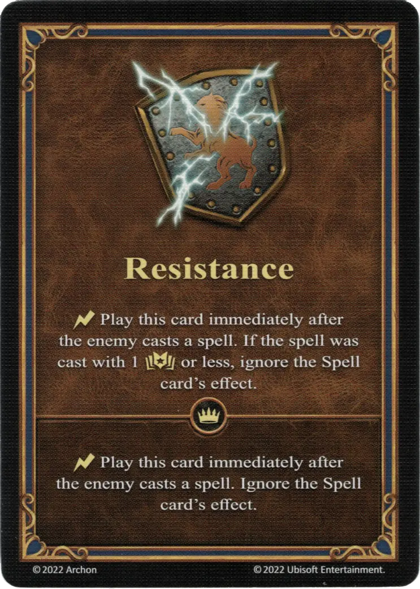

# Resistance

{ width="340" align=right }

___

[Ability](index.md)

___

:instant: Play this card immediately after the enemy casts a [spell](../spells/index.md). If the spell was cast with 1 :empower: or less, ignore the [Spell](../spells/index.md) card's effect.

___

 :expert: 

:instant: Play this card immediately after the enemy casts a [spell](../spells/index.md). Ignore the [Spell](../spells/index.md) card's effect.

___

## Heroes With Starting Ability

- [:might: Bron](../heroes/bron.md)

## Notes

- The player's primary hero must take part in the Combat. It is not possible to play Resistance if the enemy hero is in Combat with neutral units or another player.
- Resistance can nullify any spells cast by the enemy, not just those that target friendly units.

## Fourni avec

- [Core Game](../content/core_game.md)

## Voir aussi

- [List of Abilities](index.md)
- [Liste des Sorts](../spells/index.md)
