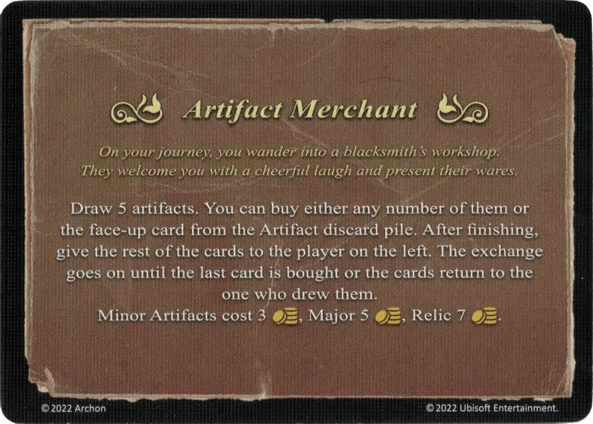

# Marchand d'artefacts

<figure markdown="span">

{ width="475" align=right }

</figure>

___

[Evénement](index.md)

___

Piochez 5 [Artefacts](../artifacts/index.md). Vous pouvez acheter tous ceux que vous désirez, ou la première carte sur la défausse [Artefact](../artifacts/index.md). Donnez ensuite les cartes restantes à votre voisin de gauche. La transaction continue jusqu'à ce que la dernière carte soit achetée, ou que les cartes vous reviennent. Les [Artefacts mineurs](../keywords/minor_artifact.md) coûtent 3 :gold:, les [Majeurs](../keywords/major_artifact.md) 5 :gold:, et les [Reliques](../keywords/relic_artifact.md) 7 :gold:.

___

*Vous passez par hasard devant l'atelier d'un forgeron. Il vous accueille en riant et vous présente ses marchandises*

___

## Fourni avec

- [Extension forteresse](../content/fortress_expansion.md)

## Voir aussi

- [Liste des Artefacts](../artifacts/index.md)
- [Liste des Evénements](index.md)
