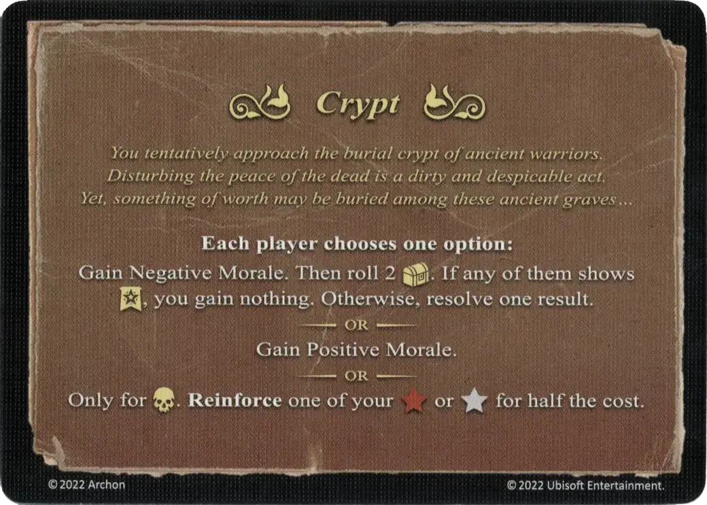

# Crypte

<figure markdown="span">

{ width="475" align=right }

</figure>

___

[Evénement](index.md)

___

**Each player chooses one option:**  Gain Negative Morale. Then roll 2 [:treasure_die:](../keywords/dice.md#treasure-die). If any of them shows :experience:, you gain nothing. Otherwise, resolve one result.  — OR —  Gain Positive Morale.  — OR —  Only for [:necropolis:](../towns/necropolis.md). **Reinforce** one of your :bronze_tier: or :silver_tier: for half the cost.

___

*Vous approchez prudemment de la crypte d'anciens guerriers. Troubler le repos des morts est un acte vil et d'une grande lâcheté. Mais quelque chose d'une grande valeur pourrait avoir été enterré ici...*

___

## Fourni avec

- [Extension forteresse](../content/fortress_expansion.md)

## Voir aussi

- [Liste des Evénements](index.md)
