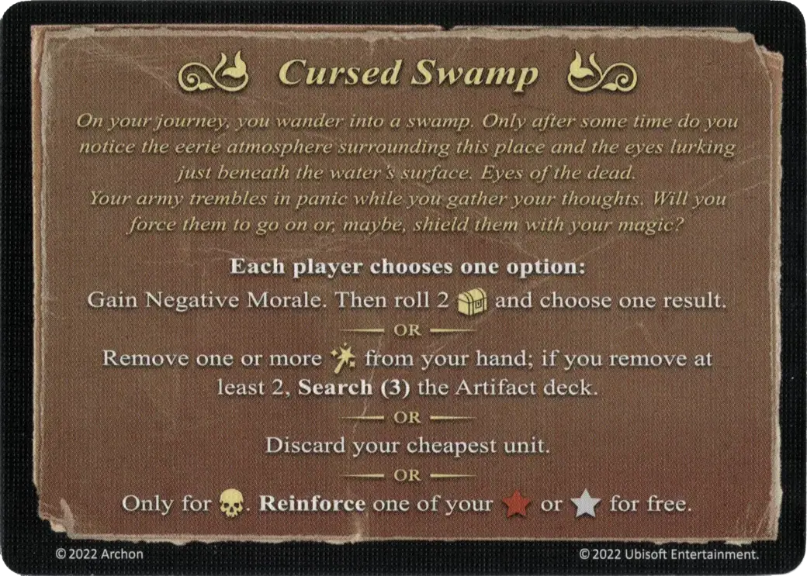

# Marais maudit

<figure markdown="span">

{ width="475" align=right }

</figure>

___

[Evénement](index.md)

___

**Each player chooses one option:**  Gain Negative Morale. Then roll 2 :treasure_die: and choose one result.  — OR —  Remove one or more [:spell:](../spells/index.md) from your hand; if you remove at least 2, **Search (3)** the Artifact deck.  — OR —  Discard your cheapest unit.  — OR —  Only for [:necropolis:](../towns/necropolis.md). **Reinforce** one of your :bronze_tier: or :silver_tier: for free.

___

**Votre voyage vous mène jusqu'à un marais. Vous mettez un certain temps avant de sentir l'atmosphère sinistre qui règne en ce lieu. Et les yeux vous observent juste sous la surface de l'eau. Les yeux des morts. Vous reprenez vos esprits tandis que la peur se propage dans les rangs de votre armée. Devez-vous les pousser vers l'avant ou utiliser votre magie pour les protéger ?**

___

## Fourni avec

- [Extension forteresse](../content/fortress_expansion.md)

## Voir aussi

- [Liste des Evénements](index.md)
- [Liste des Sorts](../spells/index.md)
