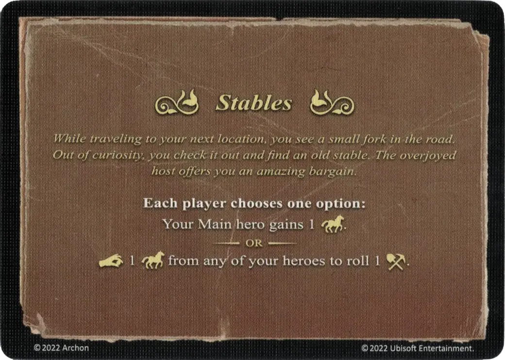

# Ecurie

<figure markdown="span">

{ width="475" align=right }

</figure>

___

[Evénement](index.md)

___

**Each player chooses one option:**  Your Main [hero](../heroes/index.md) gains +1 :movement_points:.  — OR —  :pay: 1 :movement_points: from any of your [heroes](../heroes/index.md) to roll 1 [:resource_die:](../keywords/dice.md#resource-die).

___

*En chemin vers votre prochaine destination, vous remarquez un petit chemin qui s'écarte de la route. Par curiosité, vous décidez de le suivre et arrivez devant une vieille écurie. Le propriétaire, ravi de voir quelqu'un, vous propose l'affaire du siécle.*

___

## Fourni avec

- [Extension forteresse](../content/fortress_expansion.md)

## Voir aussi

- [Liste des Evénements](index.md)
- [Liste des Héros](../heroes/index.md)
