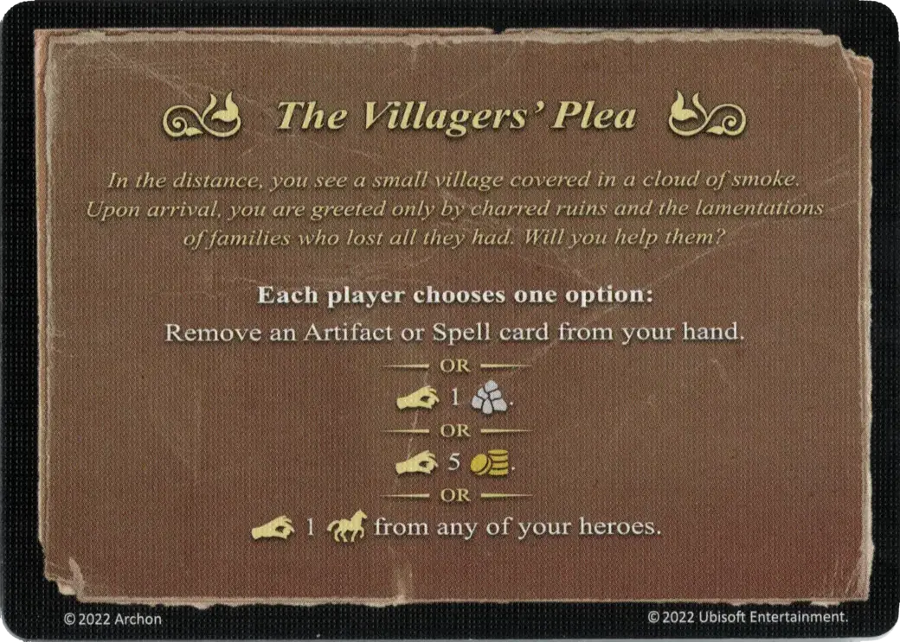

# The Villagers' Plea

<figure markdown="span">

{ width="475" align=right }

</figure>

___

[Evénement](index.md)

___

**Each player chooses one option:**  Remove an [Artifact](../artifacts/index.md) or [Spell](../spells/index.md) card from your hand.  — OR —  :pay: 1 :building_materials:  — OR —  :pay: 5 :gold:  — OR —  :pay: 1 :movement: from any of your [heroes](../heroes/index.md).

___

*In the distance, you see a small village covered in a cloud of smoke. Upon arrival, you are greeted only by charred ruins and the lamentations of families who lost all they had. Will you help them?*

___

## Fourni avec

- [Extension forteresse](../content/fortress_expansion.md)

## Voir aussi

- [Liste des Artefacts](../artifacts/index.md)
- [Liste des Evénements](index.md)
- [List of Heroes](../heroes/index.md)
- [Liste des Sorts](../spells/index.md)
