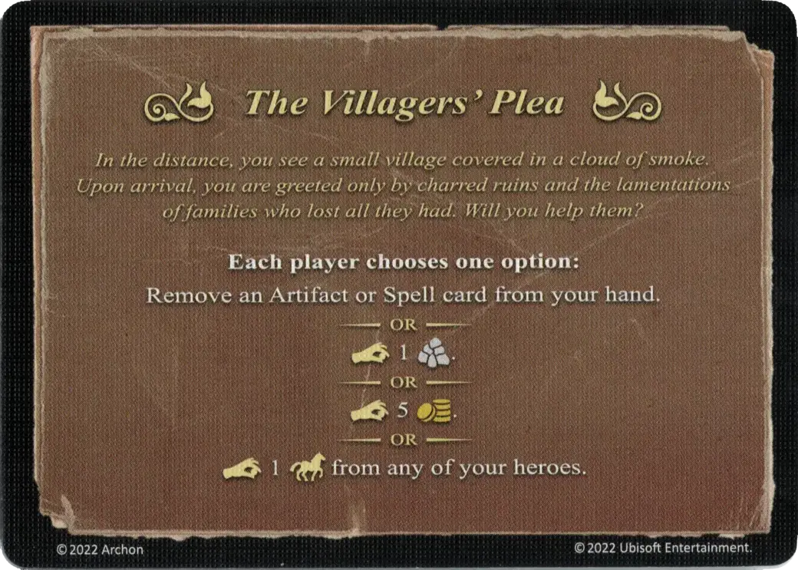

# La supplication des villageois

<figure markdown="span">

{ width="475" align=right }

</figure>

___

[Evénement](index.md)

___

**Each player chooses one option:**  Remove an [Artifact](../artifacts/index.md) or [Spell](../spells/index.md) card from your hand.  — OR —  :pay: 1 :building_materials:  — OR —  :pay: 5 :gold:  — OR —  :pay: 1 :movement_points: from any of your [heroes](../heroes/index.md).

___

*Vous distinguez au loin un petit village obscurci par un nuage de fumée. Lorsque vous arrivez, vous ne voyez que des ruines calcinées et des famille éplorées d'avoir tout perdu. Leur viendrez-vous en aide ?*

___

## Fourni avec

- [Extension forteresse](../content/fortress_expansion.md)

## Voir aussi

- [Liste des Artefacts](../artifacts/index.md)
- [Liste des Evénements](index.md)
- [Liste des Héros](../heroes/index.md)
- [Liste des Sorts](../spells/index.md)
