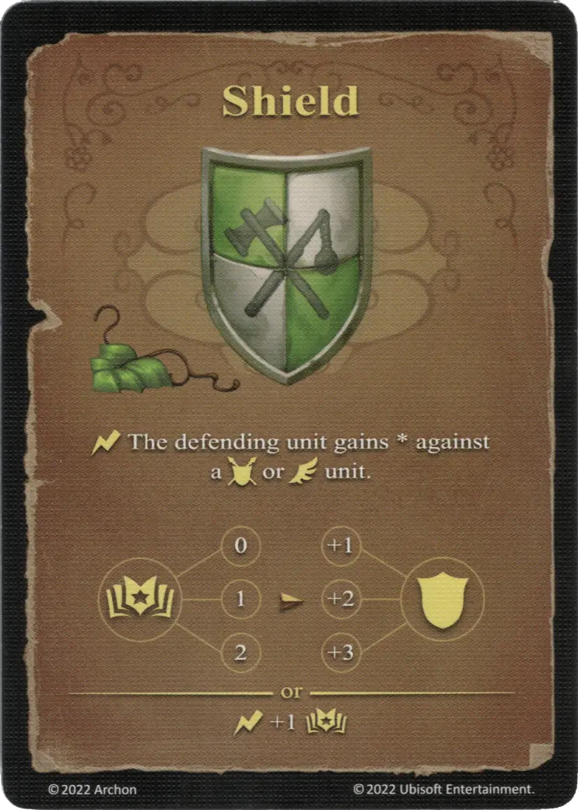

# Shield

{ width="340" align=right }

___

[Basic Earth Spell](school_of_earth_magic.md)

___

:instant: The defending [unit](../units/index.md) gains \* against a :unit_ground: or :unit_flying: [unit](../units/index.md).  :empower: 0 ➣ \*+1 :defense: :empower: 1 ➣ \*+2 :defense: :empower: 2 ➣ \*+3 :defense:  — OR —  :instant: +1 :empower:

___

## Fourni avec

- [Tower Expansion](../content/tower_expansion.md)

## Voir aussi

- [Ecole de magie de Terre](school_of_earth_magic.md)
- [List of Spells](index.md)
