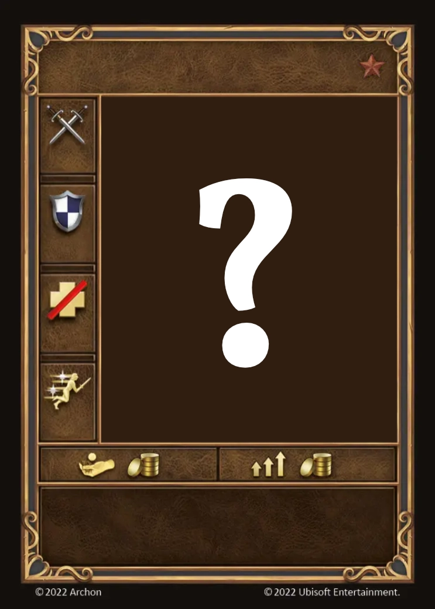

# Earth Elementals

=== "Few"

    <figure markdown="span">
        { width="340" align=right }
    </figure>

=== "Pack"

    <figure markdown="span">
        { width="340" align=right }
    </figure>

| Statistics | Few | Pack |
| :--- | :---: | :---: |
| Town | [Neutral](../towns/neutral.md) | [Neutral](../towns/neutral.md) |
| Tier | 🚧 | 🚧 |
| Type | 🚧 | 🚧 |
| :attack: | 🚧 | 🚧 |
| :defense: | 🚧 | 🚧 |
| :health_points: | 🚧 | 🚧 |
| :initiative: | 🚧 | 🚧 |
| Cost | 🚧 | 🚧 |
| Abilities | 🚧 | 🚧 |

## Notes

- Summoned by [Summon Earth Elemental](../spells/summon_earth_elemental.md).

## Fourni avec

- [Conflux Expansion](../content/conflux_expansion.md)

## Voir aussi

- [List of Units](index.md)
- [Liste des Sorts](../spells/index.md)
- [List of Towns](../towns/index.md)
